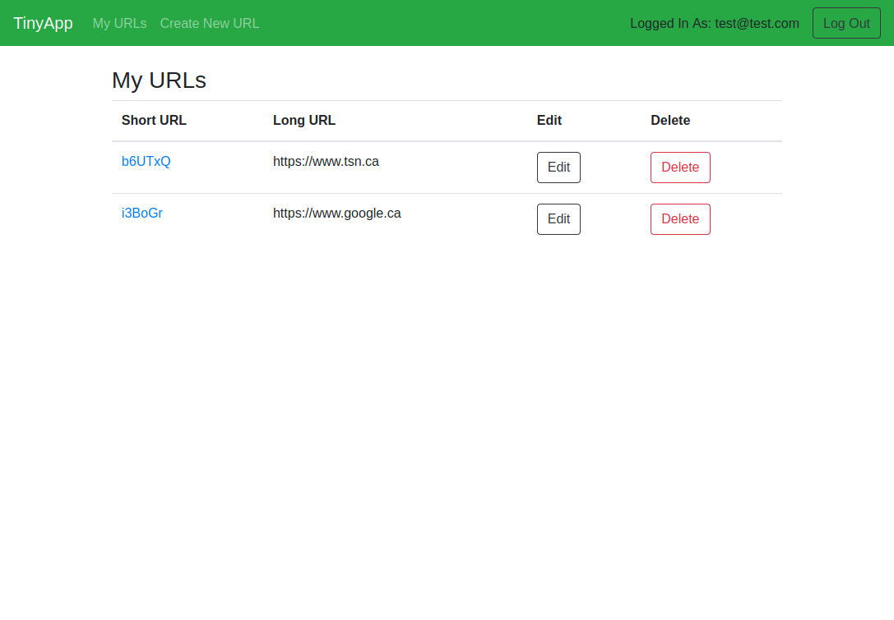
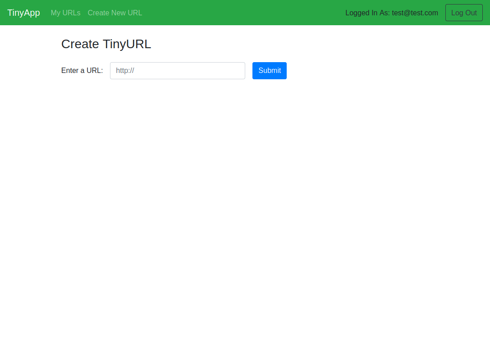

# TinyApp Project

TinyApp is a full stack web application built with Node and Express that allows users to shorten long URLs (à la bit.ly).

## Final Product

## Dependencies

- Node.js
- Express
- EJS
- bcrypt
- body-parser
- cookie-parser
- cookie-session
- randomatic

## Dev Dependencies

- chai
- mocha
- nodemon

## Getting Started

- Install all dependencies (using the `npm install` command).
- Run the development web server using the `npm start` command.
- Test log in with:
  - email: `test@test.com`
  - email: `123456789`

## Tests

- Run `npm test` to check out helper function tests
